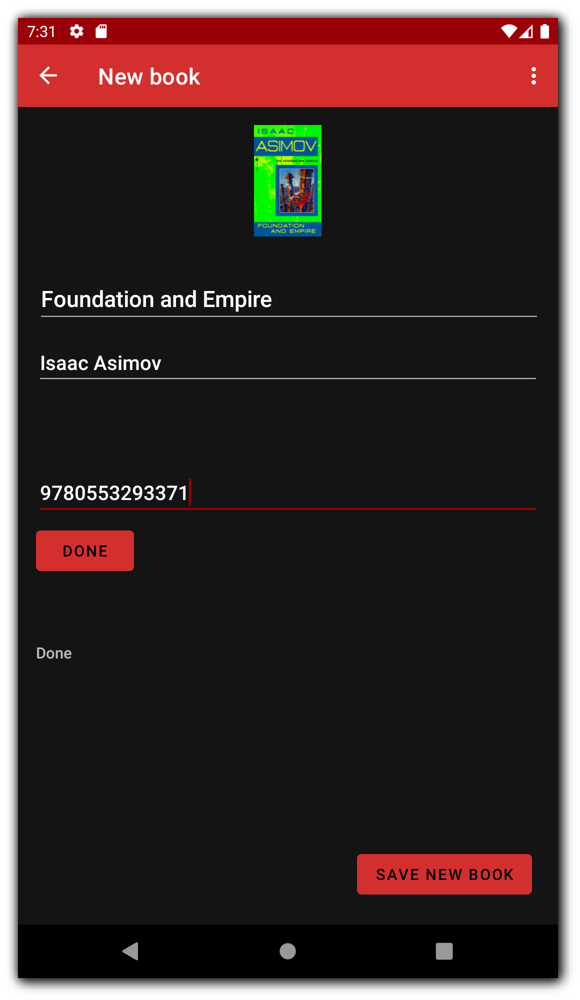
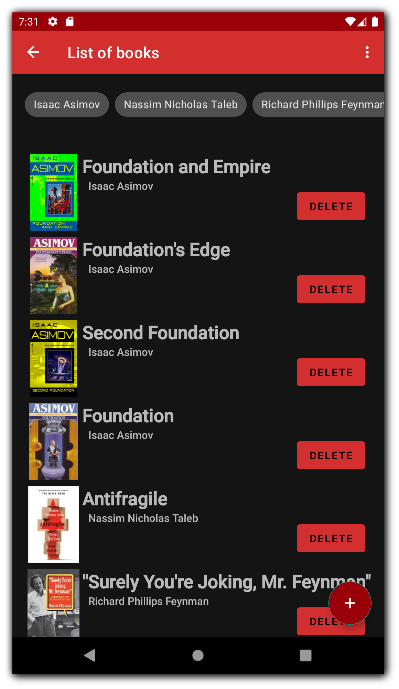
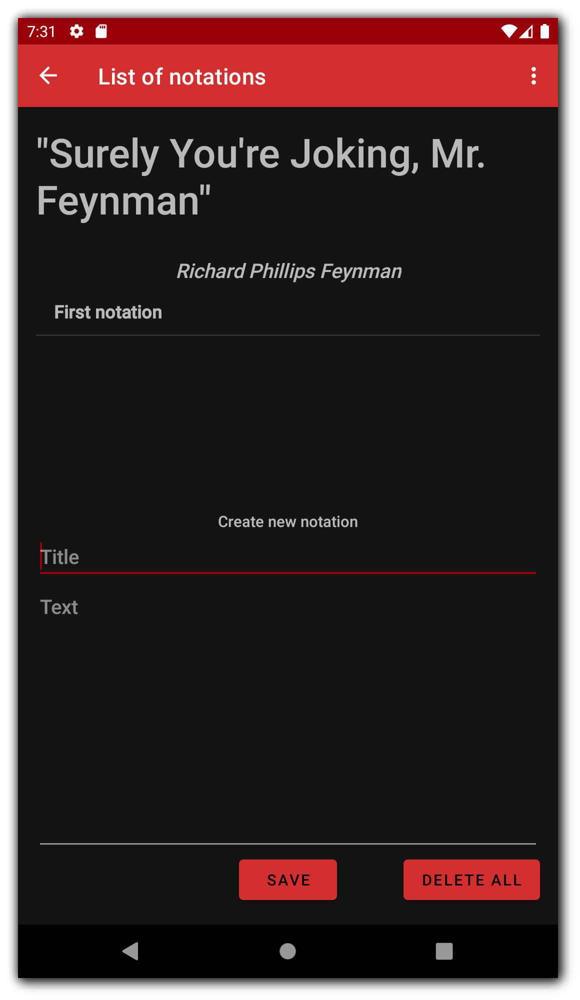
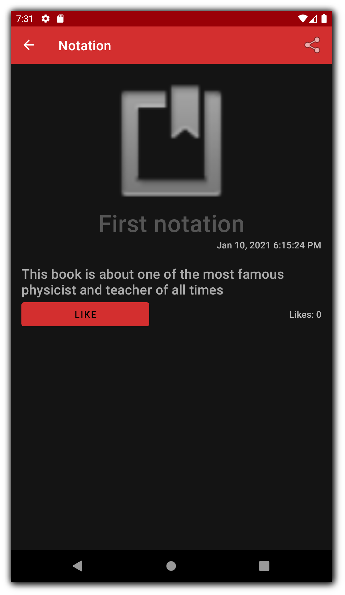

# Reading Journal
This app was developed as an exercise, while wathing [Developing Android Apps with Kotlin](https://classroom.udacity.com/courses/ud9012) course on Udacity.
## Main Features:
 - save new book
 - load book info and cover from google api via **ISBN**
 - filter books by author name
 - create new notations for each book

